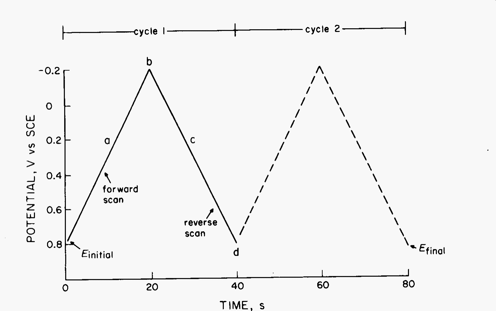
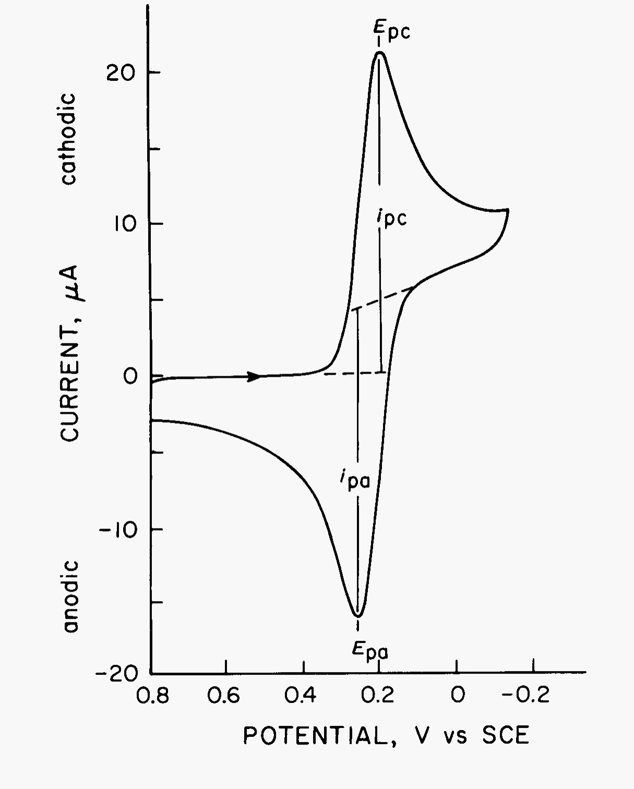
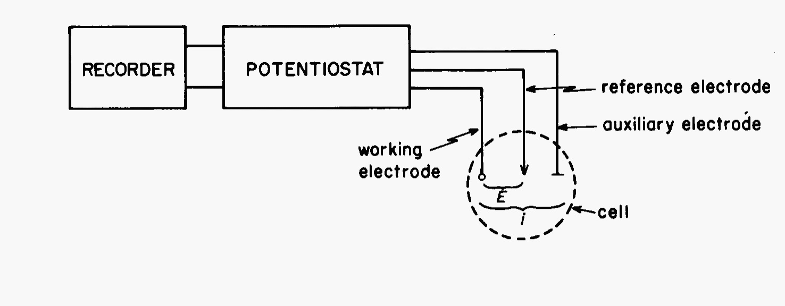
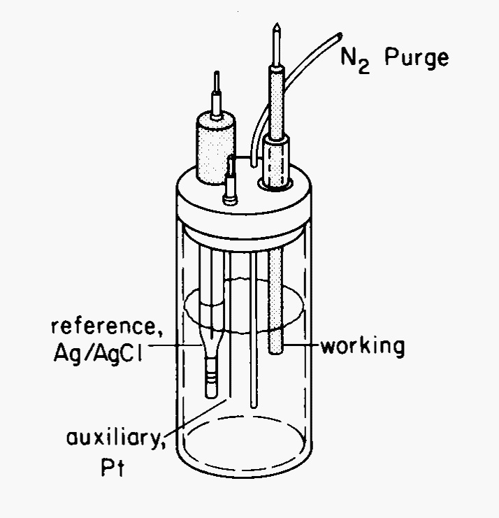

Cyclic Voltammetry of |Fe(CN)63-|/|Fe(CN)64-| Couple: Evaluation of CV as an Analytical Method
==============================================================================================

Theory
++++++
Cyclic voltammetry (CV) is perhaps the most versatile electroanalytical
technique for the study of electroactive species.  Its versatility combined with
ease of measurement has resulted in extensive use of CV in the fields of
electrochemistry, inorganic chemistry, organic chemistry, and biochemistry.  CV
is often the first experiment performed in an electrochemical study of an
inorganic or organic compound, a biological material, or an electrode surface.
The effectiveness of CV results from its capability for rapidly observing redox
behavior over a wide potential range.  The resulting voltammogram is analogous
to a conventional spectrum in that it conveys information as a function of an
energy scan.

CV consists of cycling the potential of an electrode, which is immersed in an
unstirred solution, and measuring the resulting current.  The potential of this
working electrode is controlled vs. a reference electrode such as an SCE or
Ag/AgCl electrode.  The controlling potential that is applied across these two
electrodes can be considered an :dfn:`excitation signal`.  The excitation signal
for CV is a linear potential scan with a triangular waveform as shown in
:numref:`cv-waveform`. This triangular potential excitation signal sweeps the
potential of the electrode between two values, sometimes called the
:dfn:`switching potentials`. The excitation signal in :numref:`cv-waveform`
causes the potential to first scan negatively from +0.80 to -0.20 V vs. SCE at
which point the scan direction is reversed, causing a positive scan back to the
original potential of +0.80 V. The scan rate, as reflected by the slope, is 50
mV/s. A second cycle is indicated by the dashed line. Single or multiple cycles
can be used. Modern instrumentation enables switching potentials and scan rates
to be easily varied.

.. _cv-waveform:

   Excitation signal for a cyclic voltammetry experiment.

A cyclic voltammogram is obtained by measuring the current at the working
electrode during the potential scan. The current can be considered the
:dfn:`response signal` to the potential excitation signal. The voltammogram is a
display of current (vertical axis) versus potential (horizontal axis). Because
the potential varies linearly with time, the horizontal axis can also be thought
of as a time axis.  This is helpful in understanding the fundamentals of the
technique.

A typical cyclic voltammogram is shown in :numref:`cv-voltammogram` for a
platinum working electrode in a solution containing 6.0 mM |K3Fe(CN)6| as the
electroactive species in aqueous 1.0 M |KNO3| as the supporting electrolyte.  The
potential excitation signal used to obtain this voltammogram is that shown in
:numref:`cv-waveform` but with a negative switching potential of -0.15 V. Thus, the vertical
axis in :numref:`cv-waveform` is now the horizontal axis for
:numref:`cv-voltammogram`.  The :dfn:`initial potential` (:math:`E_i`) of 0.80 V applied at the
start is chosen to avoid any electrolysis of |Fe(CN)63-| when the electrode is
switched on. The potential is then scanned *negatively* as indicated by the arrow.
When the potential is sufficiently negative to reduce |Fe(CN)63-|, :dfn:`cathodic
current` is indicated at ca 0.35 V due to the electrode process:

.. math:: \text{Fe(CN)}_6^{3-} + e^- → \text{Fe(CN)}_6^{4-}
   :label: cathodic

The electrode is now a sufficiently strong reductant to reduce |Fe(CN)63-|.  The
cathodic current increases rapidly to a maximum when the concentration of
|Fe(CN)63-| at the electrode surface approaches zero. The current then decays as
the solution surrounding the electrode is depleted of |Fe(CN)63-| due to its
electrolytic conversion to |Fe(CN)64-|.  The scan direction is switched to
positive at -0.15 V for the reverse scan.  The potential is still sufficiently
negative to reduce |Fe(CN)63-|, so cathodic current continues even though the
potential is now scanning in the positive direction.  When the electrode becomes
a sufficiently strong oxidant, |Fe(CN)64-|, which has been accumulating adjacent
to the electrode, can now be oxidized by the electrode process:

.. math:: \text{Fe(CN)}_6^{4-} → \text{Fe(CN)}_6^{3-} + e^-
   :label: anodic

This causes :dfn:`anodic current`.  The anodic current rapidly increases until
the surface concentration of |Fe(CN)64-| approaches zero and the current  peaks.
The current then decays as the solution surrounding the electrode is depleted of
|Fe(CN)64-|.  The first cycle is completed when the
potential reaches +0.80 V.  Now that the cyclic voltammogram is obtained, it is
apparent that any potential positive of approximately +0.4 V would be suitable
as an initial potential in that reduction of |Fe(CN)63-| would not occur when the
potential is applied. This procedure avoids inadvertent electrolysis as a result
of applying the initial potential.

.. _cv-voltammogram:

   Cyclic voltammogram of 6 mM |K3Fe(CN)6| in 1 M |KNO3| from +0.80 V to -0.20 V vs
   SCE at 50 mV/s.  Electrode was a 2.54 mm² platinum wire.

Simply stated, in the forward scan |Fe(CN)64-|
is electrochemically generated from |Fe(CN)63-| as indicated by the cathodic
current.  In the reverse scan this |Fe(CN)64-| is oxidized back to |Fe(CN)63-| as
indicated by the anodic current.  Thus, CV is capable of rapidly generating a
new oxidation state during the forward scan and then probing its fate on the
reverse scan.  This very important aspect of the technique is useful in
determining reaction mechanisms where intermediate species can be quickly
probed.

A more detailed understanding of the cyclic voltammogram waveform can be
gained by considering the Nernst equation and the changes in concentration that
occur in solution adjacent to the electrode during electrolysis. 

..
   1, 3, 4, 11

The important parameters of a cyclic voltammogram are the magnitudes of the
:dfn:`anodic peak current` (|ipa|), :dfn:`cathodic peak current` (|ipc|),
:dfn:`anodic peak potential` (|Epa|), and :dfn:`cathodic peak potential` (|Epc|).
These parameters are labeled in :numref:`cv-voltammogram`. One method for
measuring :math:`i_{\text{p}}` involves extrapolation of a base-line current as shown in the
figure.  The establishment of a correct base line is essential for
the accurate measurement of peak currents.  This is not always easy,
particularly for more complicated systems.

A redox couple in which both species
rapidly exchange electrons with the working electrode is termed an
:dfn:`electrochemically reversible couple`.  The formal reduction potential :math:`E°^\prime` for a
reversible couple is centered between |Epa| and |Epc|:

.. math:: E°^\prime = ½ (E_{\text{pa}} + E_{\text{pc}})
   :label: Ered

The number (:math:`n`) of electrons transferred in the electrode reaction for a
reversible couple can be determined from the separation between the peak
potentials:

.. math:: \Delta E_{\text{p}} = E_{\text{pa}} - E_{\text{pc}} \approx \frac{0.05916}{n}
   :label: dE

Thus, a one-electron process such as the reduction of |Fe(CN)63-| to |Fe(CN)64-|
exhibits a :math:`\Delta E_{\text{p}}` of approximately 0.05916 V. Slow electron
transfer at the electrode surface, "irreversibility," causes this peak
separation to increase.

The peak current for a reversible system is described by the Randles-Sevcik
equation for the forward sweep of the first cycle

.. math:: i_{\text{p}} = 2.69 * 10^5 n^{3/2} A D^{1/2} C \nu^{1/2}
   :label: randles

where :math:`i_{\text{p}}` is the peak current (A), :math:`n` is the electron
stoichiometry, :math:`A` is the electrode area (cm²), :math:`D` is the diffusion coefficient,
(cm²/s),  :math:`C` is the molar concentration, and :math:`\nu` is the scan rate (V/s).
Accordingly, :math:`i_{\text{p}}`, increases with :math:`\nu^{1/2}` and is directly proportional to
concentration.  The relationship to concentration is particularly important in
analytical applications and in studies of electrode mechanisms.  The values of
|ipa| and |ipc|, should be close for a simple reversible (fast) couple.  That is,

.. math:: \frac{i_{\text{pa}}}{i_{\text{pc}}} \approx 1
   :label: iratio

However, the ratio of peak currents can be significantly influenced by chemical
reactions coupled to the electrode process.

Instrumentation
---------------

The instrumentation for a cyclic voltammetry experiment is quite simple which
adds attraction to the technique.  A potentiostat is required to set the
potential of a working electrode with respect to a reference electrode.  The
potentiostat also has a current-to-voltage converter to measure the resulting
current between the working electrode and an auxiliary electrode.  This
arrangement prevents to reference electrode from current flow which could cause
a variation in its potential.  A typical box diagram of the instrumentation is
shown in :numref:`potentiostat` and a typical three electrode cell in
:numref:`threecell`.

.. _potentiostat:

   Instrumentation for cyclic voltammetry

.. _threecell:

   Three electrode cell

The electrochemical cell must be de-oxygenated using a flow of nitrogen or
argon.  Since cyclic voltammetry is a quiescent, or non-stirred method, to
prevent reabsorption of oxygen, the purge gas flow is directed on top of the
solution during the experiment. The reference electrode is either a
saturated calomel electrode (SCE) or a saturated silver/silver chloride
electrode.  In either case, the end of the electrode is a Vycor sleeve that
serves as a salt bridge.  Working electrodes can be platinum, carbon, or
gold.  The auxiliary electrode is often a coil of platinum wire.   If the
work is exacting in nature, the cell should be thermostated as potentials
depend on temperature.

Experimental
++++++++++++

Apparatus
    - :doc:`/instruments/Gamry1010E/docs`
    - Electrochemical cell
    - Platinum working electrode
    - Platinum auxiliary electrode
    - SCE or Ag/AgCl reference electrode
    - Volumetric flasks, 25 mL and 100 mL
    - Fine alumina or diamond powder (paste)

Chemicals
    - 10 mM potassium ferricyanide (|K3Fe(CN)6|) in 1.0 M potassium nitrate
      (|KNO3|) stock solution
    - 1.0 M |KNO3|
    - 4 mM |K3Fe(CN)6| in 1 M sodium sulfate (|Na2SO4|)
    - Unknown:  |K3Fe(CN)6| in 1.0 M |KNO3|

Procedure
---------
* Pretreatment of the platinum working electrode surface may be required.
  Simply polishing the surface with powdered alumina and rinsing thoroughly with
  distilled water should suffice.  The electrode can then be sonicated in an
  ultrasonic bath. 
* The cell is assembled and filled with 1 M |KNO3| so that the ends of the
  electrodes are immersed.  The cell is de-oxygenated by purging with N\
  :sub:`2` for approximately 10 minutes.  Following this, N\ :sub:`2` is
  directed over the solution to prevent oxygen from re-entering the cell during
  the remainder of the experiment. 
* While the cell is being de-oxygenated, the scan parameters can be set.  The
  working electrode should be disconnected or switched off during this
  procedure.  The initial potential is set at 0.80 V vs SCE, and the scan limits
  at 0.80 V (vs SCE) and -0.12 V (vs SCE) using the recorder as a monitor.  All
  scans are initiated in the negative direction with a scan rate of 20 mV/s.
  These settings are to be used unless otherwise specified. 
* When de-oxygenation is complete, the working electrode is switched on.  After
  allowing the current to attain a constant value (in about 10 s), the potential
  scan is initiated and a background CV of the supporting electrolyte solution
  is obtained. 
* After turning off the working electrode, the cell is cleaned and refilled with
  4 mM |Fe(CN)63-| in 1 M |KNO3|.  Following the same procedure as above,
  de-oxygenate the cell and obtain a CV of the |Fe(CN)63-|/|Fe(CN)64-| couple. 
* The effect of the scan rate (ν) on the voltammograms is observed by using this
  same solution and recording CV's at the following rates: 20, 50, 75, 100, 125,
  150, 175, and 200 m V/s (remember 100 mV/s is the same as 0.100 V/s so you can
  set them all!). Between each scan, initial conditions at the electrode
  surface are restored by moving the working electrode gently up and down
  without actually removing it from solution or by activating a stirring bar.
  Care should be taken that no bubbles remain on the electrodes. Allow a minute
  or two after stirring for the solution to come to rest before obtaining a CV.
* Concentration likewise affects the magnitude of the peak current.  This is
  seen by obtaining CV's on 2, 4, 6, 8, and 10 mM |Fe(CN)63-| using a scan rate of
  20 mV/s.  A voltammogram of the unknown Fe(CN)\ :sub:`6` solution should be obtained as
  well.  Give your instructor some warning that the unknown will be needed and
  supply him with a clean 25-mL volumetric and the stock 10 mM |Fe(CN)63-|
  solution.
* The effect of the supporting electrolyte on the appearance of the CV is
  demonstrated by recording two last voltammograms of 4 mM ferricyanide in 1 M
  |KNO3| and in 1 M |Na2SO4|.

Treatment of Data
-----------------
* Determine :math:`E°^\prime` and :math:`n` for the |Fe(CN)63-|/|Fe(CN)64-|
  couple in 1.0 M |KNO3| from one of the cyclic voltammograms on Pt.  Compare
  your value with one reported in the literature. (See I.M.Kolthoff and W.J.
  Tomsicek, *J. Phys. Chem.*, 39, 945 (1935)). 

* Determine the effect of scan rate on peak height by calculating |ipa|, and
  |ipc| for the various scan rates used in the scan rate experiment.  Plot |ipc|
  and |ipa| vs. :math:`\nu^{1/2}`.
 
* Determine the effect of scan rate on :math:`\Delta E_{\text{p}}` by plotting
  :math:`\Delta E_{\text{p}}` vs. ν.  Explain what causes :math:`\Delta
  E_{\text{p}}` to increase.

* Determine the effect of concentration by plotting |ipa| and |ipc| vs. [|Fe(CN)63-|].
  Also determine the [|Fe(CN)63-|] in your unknown.
 
* Discuss the effect of supporting electrolyte on the shape of the
  voltammogram, :math:`E°^\prime`,  and reversibility.

Questions
+++++++++
1. Sketch the concentration-distance profiles (concentration of each species as
   you travel away from the electrode surface into the bulk solution) for
   |Fe(CN)63-| and |Fe(CN)64-| that would be expected at the following excitation
   voltages:  0.8 V, 0.4 V, 0.25 V, -0.2V on the excitation scan and 0.1 V, 0.25
   V, and 0.8 V on the reverse scan on the CV in :numref:`cv-voltammogram`.
  
2. Using the profiles
   from Question 1 and :eq:`Ered`, explain why the current increases rapidly,
   then peaks and decays during the forward scan in :numref:`cv-voltammogram`.
  
3. What would the reverse scan look like if a stirring bar were switched on at
   the switching voltage of -0.2 V during the CV in :numref:`cv-voltammogram`.
  
4. Explain why larger peak currents are obtained for faster scan rates. (Hint:
   What is the effect of a faster scan rate on the concentration distance
   profiles?)
  
5. Sketch the voltammogram that would be obtained if |Fe(CN)64-| reacted extremely
   rapidly to give another Fe(II)-containing species that is not electroactive
   within the potential range of 0.8 to -0.2 V vs. SCE.

.. |Fe(CN)63-| replace:: Fe(CN)\ :sub:`6`\ :sup:`3-`
.. |Fe(CN)64-| replace:: Fe(CN)\ :sub:`6`\ :sup:`4-`
.. |K3Fe(CN)6| replace:: K\ :sub:`3`\ Fe(CN)\ :sub:`6`
.. |KNO3| replace:: KNO\ :sub:`3`
.. |ipa| replace:: :math:`i_{\text{pa}}`
.. |ipc| replace:: :math:`i_{\text{pc}}`
.. |Epa| replace:: :math:`E_{\text{pa}}`
.. |Epc| replace:: :math:`E_{\text{pc}}`
.. |Na2SO4| replace:: Na\ :sub:`2`\ SO\ :sub:`4`

