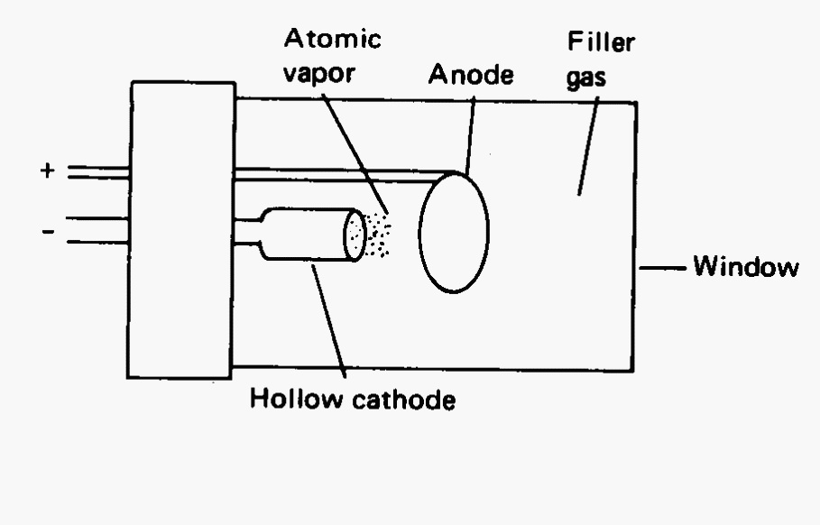
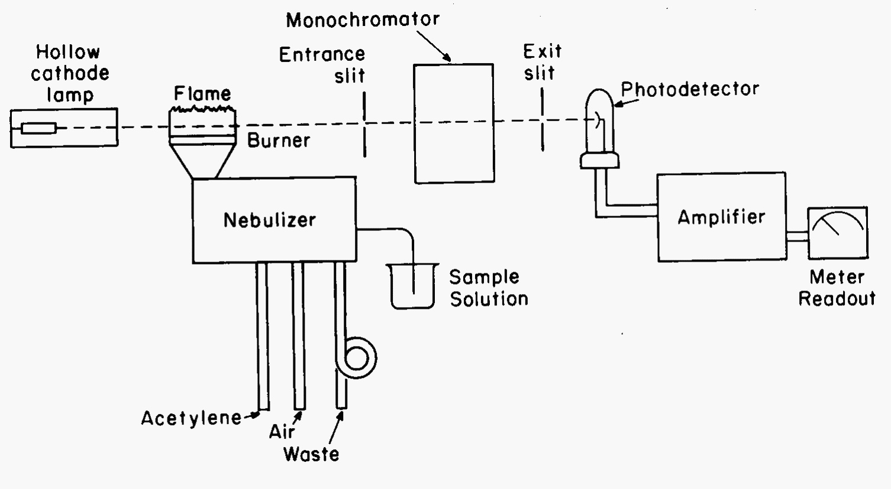
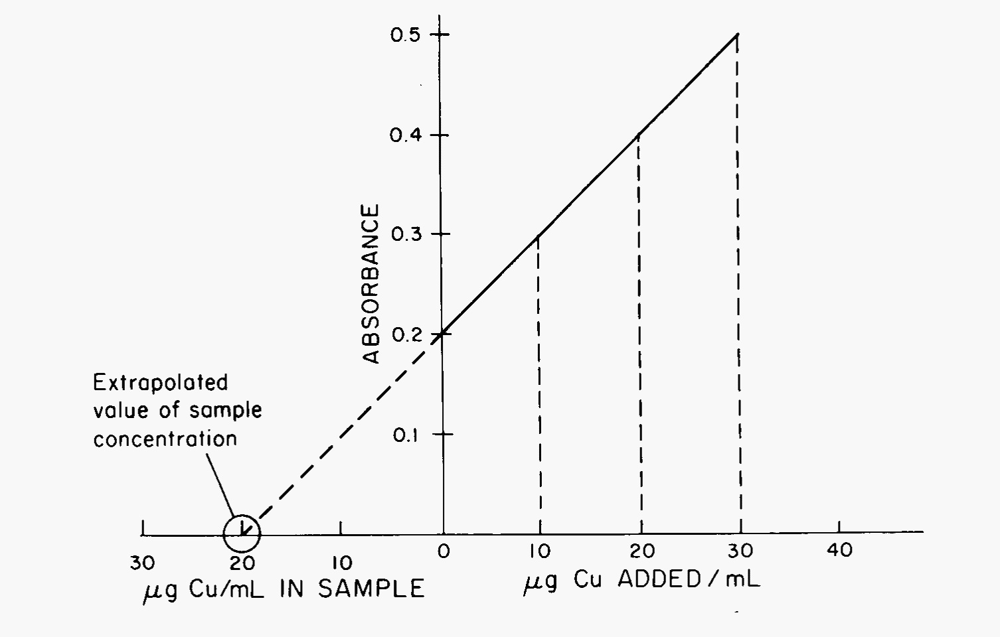

Atomic Spectroscopy
===================

Theory
++++++
Atomic spectroscopy is used for qualitative identification and quantitative
analysis of trace metals in all types of materials and solutions.  In atomic
absorption spectroscopy (AA), measurement is of radiation absorbed by an
unexcited vapour phase atom.  In an atomic emission (AE) spectroscopy, the
measurement is of energy emitted when thermally excited vapour phase atoms
return to the ground state.  In this laboratory, a flame will be used to
desolvate, vaporize and atomize the samples, and also excite in the AE
experiment.

Atomic Absorption Spectroscopy
------------------------------
Analysis of a sample by atomic absorption requires it to be heated to a high
temperature to evaporate the solvent, vaporize the sample, and dissociate the
chemical bonds to release free metal atoms.  These metals will then absorb light
characteristic of the individual species.  Atomic spectra consist of a series of
narrow bands.  The spectroscopist must choose the band with the proper
sensitivity and lack of interfering radiation. Each element will be excited by a
light source unique for that element.  These sources must produce a narrow band
of light of adequate intensity and stability over the course of the experiment.
Because a monochromator can not produce a band any where near the width of an
atomic absorption band (2 to 4 pm), the lamp must provide the bandwidth.
Typical sources are hollow cathode lamps which will have a cathode made of the
metal of interest.  The lamps are filled with an inert gas (argon or neon) which
ionizes when a voltage is passed between the cathode and an anode.  These ions
bombard the cathode causing cathodic atoms to be sputtered and a metal vapor
fills the tube.  Collisions between the metal vapor and the gas atoms causes
excitation.  Subsequent return to ground state is accompanied by a photon
emission of the perfect frequency for the analyte to absorb.  A hollow cathode
lamp is shown in :numref:`HCL`.

.. _HCL:

   Schematic of a hollow cathode lamp for AA. The cathode is made of metal being
   studied.

The hollow cathode lamp is the first part of the optical path of an atomic
absorption instrument (:numref:`flowpath`).  The design shown here is a single beam
system.  The light emitted by the lamp passes through the atomic reservoir, a
flame in this example, through a monochromator, and on to a photodetector.  The
monochromator is placed after the atomic reservoir to remove thermal emission by
the reservoir itself.  To remove any atomic emission caused by thermal
excitation of the analyte, the lamp is frequently pulsed at 60 Hz and only 60 Hz
modulated signal is recorded by the detector.  The atomic reservoir is fed by a
nebulizer system.  The nebulizer operates by the  gas flows of oxidant (air) and
fuel (acetylene) feeding the flame.  These gases pass a small orifice inside
the nebulizer causing solution to be pulled up a capillary tube and
into the nebulizer body as a mist.  The mist is mixed with the gases and
expelled out the burner head for combustion. The rate of aspiration of the
material (affected by gas pressures, nebulizer efficiency, viscosity), choice of
solvent (organics improve the nebulization), concentration (higher
concentrations increase viscosities), surface tension of the solvent (a lower
surface tension leads to better droplet formation and higher efficiency of
sample reaching the flame), and the temperature will control the amount of
sample actually available in the atomic reservoir for the analysis.

.. _flowpath:

   Schematic of single beam atomic absorption spectrometer.

Quantitative analysis is done by Beer’s law where absorbance is proportional to
concentration. Sensitivity and detection limit are two terms used to describe
the quantitative performance of an instrument. Sensitivity (for atomic
absorption) is defined as the concentration of analyte that will produce a
percent absorption of 1% (or 99% T or an absorbance of 0.0044.)  It is expressed
in terms of μg/mL per 1% absorption.  The detection limit is the concentration
of analyte which gives a signal twice the noise level of the background.  If the
detection limit is small compared to sensitivity, then small concentrations can
be measured with little error.  If the detection limit is equal to or larger
than sensitivity, then much of the signal is actually noise and error in
measuring that species will be large.

To properly quantitate, the standards used for calibration should be made in a
similar matrix to that of the sample solutions.  For example, if sera samples
are to be measured for calcium, the calibration standards should be made to
simulate serum. When a complex matrix is presented, the technique of standard
additions should be employed.  In these experiments, several small amounts of
the standard solution are added to a large amount of the sample solution to
preserve the matrix.  A plot of absorption vs added standard concentration is
plotted and the value extrapolated from the :math:`x`-axis (:numref:`calcurve`).
In order to properly extrapolate, care must be taken involving the linear range
for each species at each atomic line.  Linearity decreases above 50 μg/mL for
most species.

.. _calcurve:

   Standard additions plot showing extrapolation to unknown concentration. 

Atomic Emission Spectroscopy
----------------------------
The apparatus and theory are the same except that the excitation is thermal not
by photon absorption.  The same apparatus as AA is used with the exception that
the hollow cathode lamp is not used.

Experimental
++++++++++++

Apparatus
    - :doc:`/instruments/Agilent240FS/docs` in Flame configuration
    - Hollow cathode lamps (Cu, Ca)
    - Source of acetylene (over 100 psi) and air (over 60 psi)
    - Volumetric flasks, beakers

Chemicals
    - 1000 ppm stock solution of copper and calcium
    - 10000 ppm potassium
    - Ethanol or propanol
    - Concentrated Phosphoric acid
    - Lanthanum nitrate, 10% aqueous solution

Procedures
----------
.. note::
   This experiment was written for a PE3100 system.  All early parts may not be
   possible with the new Thermo [Agilent dam] system with that d&*% computer control.  cph

Instrument Parameters
~~~~~~~~~~~~~~~~~~~~~
Prepare the instrument according to the instruction manual using a copper hollow
cathode lamp.  Turn on the instrument and set the proper current, wavelength,
and slit width for copper (usually 324.7 nm with 0.7 nm slit for air-acetylene).
Allow the tube to warm as you align the beam with the burner. Tape a ruler to
the back wall of the burner chamber so that you can read the height of the
burner in the next part. Turn on the gases (air *first*, then acetylene).

Burner Height
^^^^^^^^^^^^^

Adjust the gas pressures to give a pale yellow flame, then turn up the
acetylene to give a strong yellow flame.  Such a flame is called fuel rich
and is yellow due to light reflecting off of unburned carbon particles.  (In
a lean flame, there is excess oxygen present and the flame is blue.)
Aspirate a 5 ppm copper solution.  Adjust the monochromator to give a
maximum signal to set the monochromator to the copper frequency.  Raise the
burner with the height adjustment knob until the light beam just passes over
the tip of the burner.  Use the ruler to measure the height above the burner
head. Zero the instrument using distilled water and measure the absorbance
of the 5 ppm copper solution as you lower the burner.  Use a fairly large
integration time to minimize noise and average several signals at each
height.  Plot absorbance vs. height of observation in the flame and select
the optimum burner height from the graph.

Fuel/Air Ratio
^^^^^^^^^^^^^^

With the air pressure constant, record the absorbance of the 5 ppm copper
solution as the acetylene pressure is adjusted in increments from a
fuel-rich (yellow) to a fuel-lean (blue) flame. When the pressure can not
uphold combustion — you have gone far enough.  Plot absorbance vs. acetylene
pressure (psi) to determine the optimum pressure for maximum sensitivity of
copper. With the optimum acetylene pressure, adjust the air pressure from a
fuel-rich to a fuel-lean flame as absorbance is measured for the 5 ppm
solution.  Plot to determine the optimum air pressure.

Treatment of Data
^^^^^^^^^^^^^^^^^

Show all three plots in your report.  Indicate whether the flame is rich, stoichiometric, or lean.

Quantitative Analysis of Copper
~~~~~~~~~~~~~~~~~~~~~~~~~~~~~~~

Calibration Curve
^^^^^^^^^^^^^^^^^
From the 100-ppm Cu stock solution, prepare 1, 2.5, 5, 7.5, and 10 ppm Cu in
100-mL volumetric flasks.  Store in plastic beakers to avoid contamination from
glass. Zero the instrument using distilled water then aspirate and record
several absorbances for each solution using water in between each sample.
Similarly, record the absorbance of an unknown.

Standard Addition
^^^^^^^^^^^^^^^^^
To 10.0 mL aliquots of the unknown placed in clean, dry beakers, add 0.2 mL, 0.4
mL, 0.6 mL, 0.8 mL, and 1.0 mL of 100-ppm Cu stock solution.  Zero the
instrument with distilled water and measure the absorbance of unknown and
unknown with various amounts of added copper.

Treatment of Data
^^^^^^^^^^^^^^^^^
Construct a calibration curve by plotting absorbance vs. concentration (in ppm).
Determine the unknown concentration from the plot.  If the plot is nonlinear,
explain the causes of nonlinearity. Calculate the analytical sensitivity for
copper, i.e., the concentration which will give an absorbance of 0.0044.  Also
calculate its detection limit. Lastly, construct a standard additions plot.
Don’t forget to correct for volumes.  Extrapolate and report the concentration
of copper in the unknown.  How does this value compare to the calibration curve?
How do the slopes compare?  You may wish to refer to
:doc:`/chem442/manual/frontmatter/InstrumentCalibration` as you decide which
answer is better!

Effect of Solvents
~~~~~~~~~~~~~~~~~~

Miscible Organic Solvents
^^^^^^^^^^^^^^^^^^^^^^^^^
Prepare solutions 1, 2.5, and 5 ppm Cu(II) in the following three solvent
systems by appropriate dilution of the 100 ppm Cu(II) stock solution: (1) water,
(2) 20% ethanol or propanol in water, and (3) 50% ethanol or propanol in water.

Use a wavelength of 324.7 nm and a 0.2 nm slit width.  Optimize the instrument
with the 5 ppm aqueous Cu solution.  Aspirate and read the aqueous solutions
using water as a reference.  Aspirate and read the 20% alcohol solutions then
readjust the flame to remove the yellow color and read the 20% alcohol solutions
again.  Return the flame to the same acetylene pressure as used for the water
samples and aspirate and read the 50% alcohol solutions.  Again readjust the
flame to remove the yellow and read the 50% alcohol solutions again.

Treatment of Data
^^^^^^^^^^^^^^^^^
On a single axes, plot all the calibration curves.  Which solvent system
exhibits the best sensitivity for copper?  Explain. Why are we not concerned
with best linearity? Explain.

Interferences
~~~~~~~~~~~~~

Ionization Interference in Calcium Determinations
^^^^^^^^^^^^^^^^^^^^^^^^^^^^^^^^^^^^^^^^^^^^^^^^^
Ions of an element absorb light at a different frequency than its neutral atoms.
Addition of an excess of a more easily ionized element will produce a large
number of free electrons in the flame and shift the ionization equilibrium so
that the element of interest is insignificantly ionized.

Prepare (a) calcium solutions of 8 ppm and 200 ppm containing 0, 1, 10, 100, or
1000 ppm potassium and (b) calcium solutions of 8 and 200 ppm without potassium.

Use a calcium hollow cathode lamp, a wavelength of 422.7 nm and a slit of 0.2
nm.  A nitrous oxide-acetylene flame would give a more noticeable effect but the
air-acetylene flame will suffice.

For the 8 ppm solutions, set the aspiration at a fairly fast rate.  Zero the
instrument using distilled water and record the absorbance of each solution.
With the 200 ppm samples, set the aspiration to a much slower rate and using
distilled water as the blank, record each solutions absorbance.  In either case,
measure aspiration rate.

Treatment of Data
^^^^^^^^^^^^^^^^^
Plot absorbance vs concentration of potassium.  From the plots, determine the
minimum amount of potassium needed to overcome calcium’s ionization effects.
Explain!

Phosphate Interference
^^^^^^^^^^^^^^^^^^^^^^

Atomic absorption signals for alkaline earth elements are depressed by the
presence of anions such as phosphate which form relatively nonvolatile compounds
(like calcium pyrophosphate) in the flame.  This type of chemical interference
can be minimized by solvents which cause smaller particles to form in the
nebulizer.  These smaller particles are more easily vaporized. Hotter flames can
also produce more vaporization (and often ionization).  In addition, an excess
of a chemical releasing agent, a species which has a larger equilibrium constant
with phosphate may be used.

Prepare solutions of 200 ppm Ca in 50 mL of 95% ethanol plus 0, 0.1, 0.3, 1.0,
3.0, or 10.0 mL of concentrated phosphoric acid (85% acid, 14.7 M) with dilution
to 100 mL with water.  Flames of nitrous oxide-acetylene (2990 K) and
air-acetylene (~2500 K) are used.  Use a wavelength of 422.7 nm and a 0.2 nm
slit.  Use a blank with an appropriate amount of phosphoric acid and ethanol to
set the instrument to zero.

Also prepare 20 ppm calcium with 0, 0.1, 0.3, 1.0, 3.0, and 10.0 mL of
concentrated phosphoric acid and containing 1% lanthanum or strontium with
dilution to 100 mL.  Use an air-acetylene flame with the conditions as above.

Treatment of Data
^^^^^^^^^^^^^^^^^
For the ethanol solvents, plot the results for both burners on the same axis.
Plot apparent calcium concentration vs. Log of the mole ratio (Ca/PO\ :sub:`4`) for both
sets of data.  Explain how the signal for 200 ppm Ca varies with presence of
phosphate, e.g., where does Ca go? For the lanthanum, plot absorbance vs
phosphate concentration and explain the curve shape, e.g., why does Ca come
back?

Shutdown
--------
Turn off the acetylene at the main tank valve and allow the line to purge free
and the flame to go out. Then, shut off the air and bleed the line of excess
pressure so as to not damage instrument components. Set the lamp current to zero
and turn off the instrument.

Questions
+++++++++
1. A premix or laminar flow burner does not introduce all the material into the
   flame and the larger droplets are drained off to waste.  How is air prevented
   from backing up into the burner and possibly causing an explosion?

2. What other anions are likely to cause low responses for alkaline earth
   samples?  Explain.

3. In atomic absorption spectroscopy why is the monochromator located after the
   sample compartment (the flame) rather than before as in the case of a
   UV-visible absorption spectrophotometer?

4. What is beam modulation and why is it used in atomic absorption spectroscopy?

5. Why are atomic absorption lines so sharp compared to the absorption lines of
   a molecule dissolved in solution?

6. How does the detection limit of atomic absorption compare with flame
   emission?  Give some specific examples.
