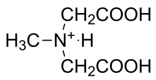

Determination of the Protonation Sequence of Methyliminodiacetic Acid and of the Stoichiometry of the Molybdenum-Methyliminodiacetic Complex by Proton NMR
==========================================================================================================================================================

Theory\ [#f1]_
++++++++++++++

Methyliminodiacetic acid (MIDA) is a metal complexing agent similar to EDTA,
with three acidic protons.  Using the relative acidity of these protons, the
identities of the peaks in the NMR spectrum can be determined.  In addition,
the stoichiometry of the Mo(VI) complex of MIDA will be determined by observing
NMR line shifts as a function of pH or Mo(VI) concentration.

Experimental
++++++++++++

Apparatus
---------

* NMR spectrometer (:doc:`/instruments/Bruker400MHzNMR/docs`)
* NMR tubes (8)
* Pipets (2), 1 mL
* Disposable pipets and bulbs
* Beakers, ten 10 mL, one 25 mL

Chemicals
---------

* 0.5 M MIDA in |D2O|
* 15 mL 0.5 M sodium molybdate (|Na2MoO4|) in |D2O|
* 10 mL 6.0 M hydrochloric acid (HCl) in |D2O|
* 6.O M sodium hydroxide (NaOH) in |D2O|
* t-Butyl alcohol, a few drops per NMR tube
* pH paper (pH 1 to 12) or pH meter

.. _mida-spectrum:

Part I: Determination of the MIDA Spectrum
------------------------------------------

Theory
~~~~~~

At pH 0, MIDA is fully protonated (:numref:`mida`).

.. _mida:

   Structure of MIDA at pH 0.

Because both the carboxylic acid and amine protons are acidic, incremental
addition of base will cause sequential chemical shifts of the neighboring C---H
protons.  Knowing the relative acidities of these two groups the C---H proton
peaks can be assigned.  The experiment can also be performed in the reverse
where the chemical shift data can be used to assign relative acidities of the
groups.  This is useful when two identical groups are present with different
|pKa|'s (several amino acids come to mind).

Remember, the chemical shift is directly related to the electron density around the nucleus.

Procedure
~~~~~~~~~

Take about 15 mL of 0.5 M MIDA stock solution and pipet 1 mL into a 10-mL
beaker.  By use of 6 M HCl or 6 M NaOH dissolved in |D2O| (minimize exposure to
air which will lead to a huge water Raman line), adjust the pH of the MIDA
solution to zero.  Add 1 mL of 0.5 M MIDA to each of two other 10-mL beakers.
Adjust the pH of the second to pH 6 and of the third to pH 12. Add a few drops
of t-butyl alcohol to each beaker.   Fill three 5-mm NMR tubes to a depth of
about 50 mm with the various MIDA solutions and record their spectra. Set
t-butyl alcohol as the 0.0 ppm shift.  How many peaks do you expect to see?
Make sure you have spectra where the peaks of interest are large enough to see
and measure!

Treatment of Data
~~~~~~~~~~~~~~~~~

Assign all peaks observed in the spectra of MIDA by observing the change in
each peaks chemical shift as the pH is changed.  Remember that butyl alcohol,
not TMS, was used as the reference.

Questions
~~~~~~~~~

1. Why are fewer peaks seen in the spectra of MIDA than could be expected?

2. How do the assigned peaks chemical shifts compare to those measured with TMS
   as the reference?

.. _mida-stoic:

Part II: Determination of the Stoichiometry of the Mo-MIDA Complex
------------------------------------------------------------------

Theory
~~~~~~

Below pH 8, Mo(VI) forms a complex with MIDA.  By recording spectra of
solutions with fixed amounts of Mo(VI) and varying amounts of MIDA, the
stoichiometry for the complex can be determined using peak assignments made in
:ref:`mida-spectrum`.  Each peak above illustrates its characteristic shielding
depending on if the neighboring site is occupied or vacant.  With these
assignments, the determination of the stoichiometry and structure of the
complex should be easily determined. You are encouraged to set up models and/or
tables to assist in this determination.  Make sure your spectral output is
large enough for you to see each applicable peak!

Procedure
~~~~~~~~~

Obtain 10 mL of 0.5 M |Na2MoO4| stock solution, and five more 10-mL beakers.  Use
the remaining 0.5 M MIDA stock solution to pipet the amounts of MIDA and Mo(VI)
listed in :numref:`mida-table`.  Add a few drops of t-butyl alcohol to each.
Fill five NMR tubes (as above) with the solutions and record their spectra.

.. _mida-table:
.. table:: Amounts of |Na2MoO4| and MIDA for stoichiometry determination.

   ====== ===================== ============== =========
   Beaker Stoichiometry Mo:MIDA |Na2MoO4| (mL) MIDA (mL)
   ====== ===================== ============== =========
   1      1:0.5                 2              1
   2      1:1                   1              1
   3      1:1.5                 2              3
   4      1:2                   1              2
   5      1:3                   1              3
   ====== ===================== ============== =========

Treatment of Data
~~~~~~~~~~~~~~~~~

What is the stoichiometry of the MO-MIDA complex? Explain.

Questions
~~~~~~~~~

Some of the spectra obtained in :ref:`Part I <mida-stoic>` contain no excess MIDA.  A
comparison of the spectra of bound MIDA and free MIDA (as seen in :ref:`Part II <mida-spectrum>`) shows
remarkable differences, including a change in the number of peaks.  Explain why
the bound and free MIDA exhibit different spectra, remembering that two protons
in the same magnetic environment will give only one peak.

.. hint::
   Make a model of the free MIDA and of the Mo-MIDA complex.
  
Does molybdenum bind to the nitrogen or carboxylate groups of MIDA, or does it
bind to all three groups?

Illustrate the Mo-MIDA complex as you have described it above.

References
~~~~~~~~~~

1. J. W. Akitt, "N.M.R. and Chemistry; An Introduction to Nuclear Magnetic Resonance Spectroscopy," Chapman and Hall, London, 1973.
2. S. I. Chan, R. J. Kula, and D. T. Sawyer, *JACS*, **1964**, 86, 377.
3. L. V. Haynes and D. T. Sawyer, *Inorganic Chem.*, **1967**, 6, 2146.
4. R. J. Kula, D. T. Sawyer, S. I. Chan, and C. M. Finley, *JACS*, **1963**, 85, 2930.
5. R. J. Kula and D. T. Sawyer, *Inorganic Chem.*, **1964**, 3, 458.

.. [#f1] The theory behind NMR was covered in CHEM282: Organic Chemistry 2, and
   will not be covered here.  The instructor has suggestions of texts one can
   read to review NMR theory starting with chapter 19 of Skoog, Holler, and
   Nieman.
.. |D2O| replace:: D\ :sub:`2`\ O
.. |Na2MoO4| replace:: Na\ :sub:`2`\ MoO\ :sub:`4`
.. |pKa| replace:: pK\ :sub:`a`
