Synthesis and Analysis of Quantum Dots
======================================

Perkin Elmer Lambda 1050 (UV-Vis)
---------------------------------

- After sample preparation, your samples will be run using thin
  cuvettes (Brand Precision Cells Inc. Ocean Optics)
- Check that the instrument is on and open the software *PerkinElmer UV
  WinLab* and select *Analyst* from the drop down menu
- Select :menuselection:`New --> Method` and from the instrument drop down select
  *High performance UV/Vis/NIR instrument* click next, then next again
  (this just confirms that the *L1050/URA* is selected
 
  |new_method.png|

  |hp.png| 

- Select the *Scan* type then click next and select the *Three Detectors Module*

  |scan.png| 

- Finally, click *Save/Finish* and chose a folder to save the method to and give
  it a name
- After creating a method, you will be prompted to the data collection screen,
  on the left is a panel of different setting that you can adjust

  |parameters.png|

- Under *Data Collection* you will need to adjust *Method
  Settings* 

  .. attention:: 
     Make sure the D2 lamp and the Tungsten lamp are selected. (D2 is for the UV
     region and Tungsten is for the Visible region.)

  |params_overall.png|

- In the paper, *Simple Syntheses of CdSe Quantum Dots* in Figure 5, the UV/Vis
  wavelength range was from 400-600 nm, therefore you should enter these
  parameters in this section.
 
  |method.png|

- Under *Cycles* we entered 1 for the number of cycles and 2 seconds (We did not
  check *As fast as possible* because we initally had poor resolution and
  garbage data.

  |cycle.png|

- Under *Sample Info* the sample ID can be adjusted by double clicking (you can
  also add/delete rows as well)

  |samples.png|

- If you click on the *Type* you can change to either *Blank*, *Control*, or
  *Sample* depending on which you need (blank used here is 1-octadecene)

  |type_of_sample.png|

- The rest of the tasks were not adjusted, from here you can place your blank in
  the sample holder and click *Start*\ … it will first go through some 100%
  Transmittance and other background scans, but it is fine if your blank remains
  in the cell during this process

  |start.png|

- Eventually, the instrument will prompt you to place your blank in, just select
  “OK” and after the scan it will begin prompting you to enter your samples in
  the order in which you labeled them under *Sample Info* tab

- At any point in time, you can click *Cancel* when the scan is finished, and
  return to the *Sample Info* tab where you can insert another row and perhaps
  redo a sample or even delete a sample if necessary

- You will then be able to click *Start* again and resume where you left off -
  Finally, after all of your samples are run, you can click *Send to DPV* where
  another software opens up and you can export your data, do calculations, or
  analyze your results

- If you export, you can do so as a csv file and use a flash drive which will
  open as an Excel file

PerkinElmer LS55 Fluorescence Spectrometer
------------------------------------------

- Following the instructions on the wiki page for the fluorimeter, you will need
  to create a :menuselection:`new method --> FL Scan --> OK`

- Under Samples you can add the same amount as in UV/Vis and the comparment was
  adjusted to include the sample holder shown below

  |detector.jpg|

- The parameters for the sample runs is listed below. You want to do an emission
  scan and set the excitation wavelength to 400 nm. The gain was set to low to
  allow less fuzzy emission spectra.

  |hce.jpg|

- Once done, data can be saved and exported as a ascii.txt document to open in
  excel and perform data workup.

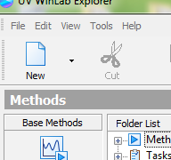
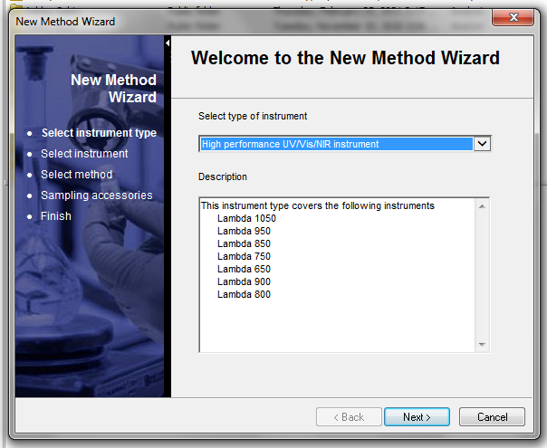
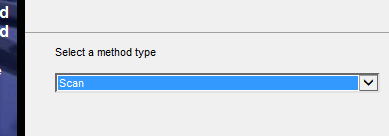
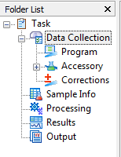
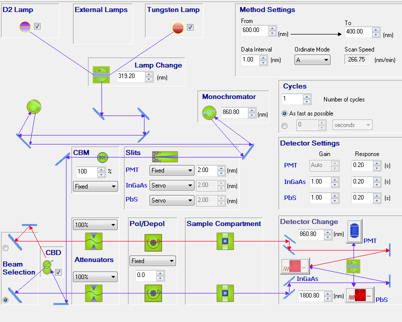
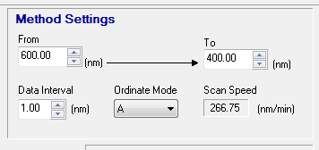
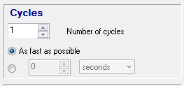
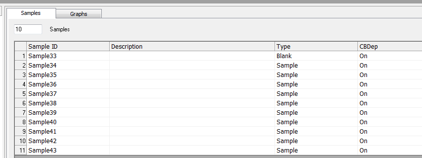
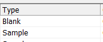
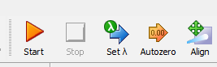
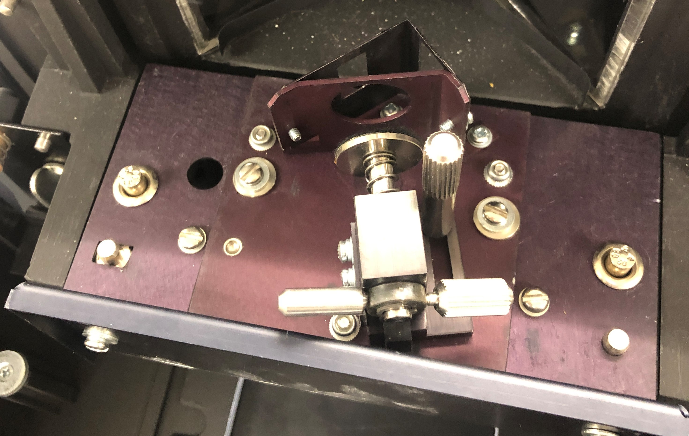
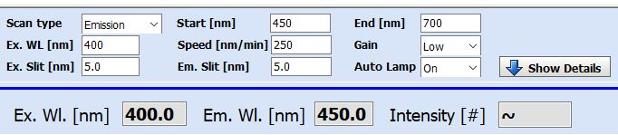
