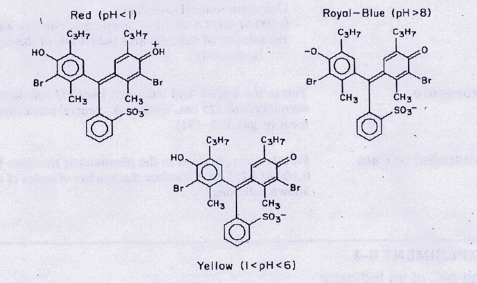
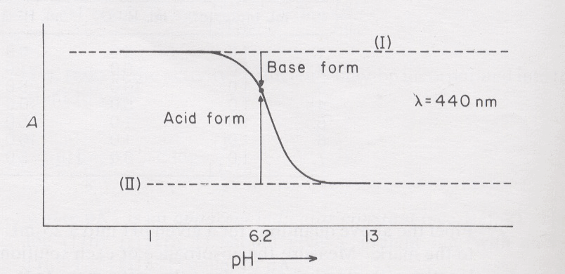

The |pKa| of an Indicator UV Absorption Spectrophotometry
=========================================================

The use of spectrophotometry for the evaluation of the |pKa| of an acid-base
indicator is demonstrated in this experiment.

Theory
++++++

This lab is written to present a challenge to the chemist.  The theory and the
experimental set-up are all aimed at bromothymol blue
(3′,3″-dibromothymolsulfone-phthalein), a member of a large class of acid-base
indicators known as "sulfone-phthaleins".  However, you will be assigned a
different indicator in probably a different class and will need to consider how
to adapt the experiment for that different dye!  Be sure to start early so you
don't finish late!  It is also imperative to keep in mind the goals of the
experiment as well as data reduction.

Bromothymol blue has three possible forms depending on pH, as showin in
:numref:`uv-bromothymol-blue`. The equilibrium
between the yellow acid form (|HIn-|) and the
royal-blue basic form (|In2-|) can be represented as

.. math:: \text{HIn⁻} + \text{H}_2\text{O} \rightleftharpoons \text{H}_3\text{O⁺} + \text{In²⁻}
   :label: In-chem-eqn

and the equilibrium constant for the acid dissociation is

.. math:: K_{\text{a}}  =  \frac{\mathcal{A}_{\text{H}_3\text{O⁺}} \mathcal{A}_{\text{In²⁺}}}{\mathcal{A}_{\text{HIn⁻}}}
   :label: In-Ka

where :math:`\mathcal{A}` refers to the activity.

.. _uv-bromothymol-blue:

   Structure of bromothymol blue at different pH.

Converting to logarithmic form and rearranging terms yields

.. math:: \text{pH}  =  \text{pK}_{\text{a}}  +  \log \left( \frac{\mathcal{A}_{\text{In²⁻}}}{\mathcal{A}_{\text{HIn⁻}}} \right)
   :label: In-HH

Since activity is directly related to concentration by activity coefficient γ\ :sub:`i`,
this expression can be expressed as

.. math:: \text{pH}  =  \text{pKa}  +  \log \left( \frac{\text{In²⁻}}{\text{HIn⁻}} \right) + \log  \left(\frac{γ_{\text{In²⁻}}}{γ_{\text{HIn⁻}}}\right)
   :label: In-HH-gamma

The ratio of activity coefficients may be incorporated into the equilibrium
constant to give

.. math:: \text{pH}  =  \text{pK}^′_{\text{a}}  +  \log \left( \frac{\text{In²⁻}}{\text{HIn⁻}} \right)
   :label: In-HH-simplified

where |pKa'| is an *apparent indicator constant*.  Thus a plot of pH vs
:math:`\log \left( \frac{\text{In²⁻}}{\text{HIn⁻}} \right)` should give a straight
line with an intercept (at which [|In2-|] = [|HIn-|]) equal to |pKa'|.

In this experiment, the indicator bromothymol blue is dissolved in a series of
buffer solutions of known pH.  The ratio :math:`\frac{\text{In²⁻}}{\text{HIn⁻}}`
is then measured spectrophotometrically and |pKa'| is calculated from a plot of
:eq:`In-HH-simplified`.

Experimental
++++++++++++

Apparatus
---------

* Spectrophotometer (:doc:`/instruments/PELambda1050/docs`)
* Cuvettes (2)
* Pipets, 1 mL, 5 mL, and 10 mL
* Beaker (3),  100 mL
* Volumetric flasks (4), 25 mL

Chemicals
---------

* indicator such as bromothymol blue, 0.1% in ethanol
* 0.10 M sodium hydrogen phosphate
* 0.10 M potassium dihydrogen phosphate
* Hydrochloric acid (conc)
* 4 M sodium hydroxide

Procedures
----------

.. note::

   Bromothymol blue is unstable in acid media over prolonged periods of time.
   Therefore, obtain all absorbance measurements with a solution on the same
   afternoon that you prepare the solution.

A. Absorption Spectra of Bromothymol Blue at Various pH Values
~~~~~~~~~~~~~~~~~~~~~~~~~~~~~~~~~~~~~~~~~~~~~~~~~~~~~~~~~~~~~~

pH ≈ 1
    Carefully pipet 1 mL of bromothymol blue stock solution into a clean 25-mL
    volumetric flask.  Add a few milliliters of distilled water, then 4 drops
    of concentrated HCl, and finally dilute to the mark with distilled water.
    Transfer some to a cuvette and obtain an absorption spectrum between 350
    and 600 nm.

pH ≈ 6.9
    Pipet 1 mL of indicator in a 25-mL volumetric flask and add 5 mL each of
    0.10 M |Na2HPO4| and |KH2PO4| from a pipet.  Dilute to the mark and obtain the
    spectrum.

pH ≈ 13
    To 1 mL of indicator in a 25-mL volumetric flask, add 12 drops of 4 M NaOH.
    Dilute to the mark and obtain the spectrum.

The three curves, when plotted on a single axis should intersect each other at
a single point, called an isosbestic point.

B. Absorbance of Solutions (Differing in pH) at Selected Wavelengths
~~~~~~~~~~~~~~~~~~~~~~~~~~~~~~~~~~~~~~~~~~~~~~~~~~~~~~~~~~~~~~~~~~~~

Refer to the graph you have made and select two wavelengths at which further
absorbance measurements will be made.  You should select a wavelength to the
left of the isosbestic point and one to the right of this point.  Choose
wavelengths where the acid and base forms of the indicator show a maximum
difference in their absorbance.

Measurements will be made on solutions with seven different pH values other
than the three solutions studied thus far.

====== ============ =========== =========== ====
Sample mL indicator mL |H2PO4-| mL |HPO42-| pH
====== ============ =========== =========== ====
1      1.0          5.0         0.0         ~4.5
2      1.0          5.0         1.0         6.2
3      1.0          10.0        5.0         ?
4      1.0          5.0         10.0        ?
5      1.0          1.0         5.0         ?
6      1.0          1.0         10.0        ?
7      1.0          0.0         5.0         ~9.1
====== ============ =========== =========== ====

Pipet the above quantities for a given pH into a 25-mL volumetric flask and
dilute to the mark. Measure the absorbance of each solution at the two selected
wavelengths.  Remember to readjust the instrument to 0 and 100%T whenever you
change the wavelength setting.  Alternatively, it can be very effective to scan
each sample and extract the absorbance information from the plot. Calculate the
pH of the above solutions given the fact that the second ionization constant
for phosphoric acid is 1.3 × 10\ :sup:`-7` (pK₂ = 6.89).  Alternatively, pH
values can be measured by a pH meter.

Treatment of Data
+++++++++++++++++

.. caution::
   This is written for the experiment enclosed.  Since you used a different
   indicator, your pH values will be different and you will need to THINK about
   the data reduction!

Combining the absorbance values at the two selected wavelengths (obtained in
Procedure A) with the data obtained in Procedure B, plot absorbance vs. pH for
each of the two wavelengths studied.  The midpoint of each curve corresponds to
equal concentrations of the acid and of the base forms of the indicator.  From
each graph, determine the |pKa'| of the indicator.

Draw two horizontal lines across each of your A vs. pH plots; one corresponding
to the absorbance of the acid form of the indicator and the other corresponding
to base form of the indicator.  Any deviation of the actual absorbance from
these two lines is a measure of the extent to which one form or the other has
been converted to the other form.

Consider the absorbance reading obtained for the pH 6.2 solution
(:numref:`uv-AvpH`). By subtracting the absorbance at 6.2 from the absorbance at pH 1,
a measure of the amount of |In2-| in the solution at pH 6.2 can be obtained.  By
subtracting the absorbance at pH 13 from the absorbance at pH 6.2 a comparable
measure of the amount of |HIn-| in the pH 6.2 solution can be obtained. The
ratio of |In2-| to |HIn-| can then be found. The ratio also can be found by
measuring with a ruler the relative lengths of the two arrows indicated in
:numref:`uv-AvpH`.

.. _uv-AvpH:

   Aborption of an acid-base indicator as a function of pH.

Determine the |In2-|/|HIn-| ratio that corresponds to each of the
points plotted on one of your two absorbance vs. pH graphs, and plot
:math:`\log \left( \frac{\text{In²⁻}}{\text{HIn⁻}}\right)` vs. pH.  That point
where the line crosses the vertical axis at zero concentration corresponds to
equal concentrations of the acid and base forms thus we can obtain the |pKa'|.
Report all three values for |pKa'|.

Discussion must include comparisons to literature values for the |pKa| as well
as consideration of the color change range.  You should also consider how you
performed the experiment and include changes you would make in the procedure
based on your experience.

Questions
+++++++++

#.

   a. What is meant by an isosbestic point?
   b. If the molar absorptivities of |HIn-| and of |In2-| were determined at a
      wavelength corresponding to an isosbestic point, how would they compare in
      value?
   c. What factors could contribute to the inability of an operator to
      obtain an isosbestic point in a study of this nature?
   d. Could this experiment be applied to an indicator for which no isosbestic
      point was obtained in the available spectral range?  Explain briefly.

#. If you were given a series of your indicator solutions of varying pH and
   were asked to determine the total amount of indicator present in each
   solution, how would you choose wavelengths and how would you perform the
   analysis?  (ps, a pH meter is not available)

#. Suppose the indicator under study  were a dibasic acid which dissociated
   according to the general equation:
  
   .. math:: \text{H₂In}  +  2 \text{H₂O}  \leftrightharpoons   2 \text{H₃O⁺}  +  \text{In²⁻}

   with both hydrogens coming off simultaneously in a single step (a rare
   case).

   a. If :math:`\log \left( \frac{\text{In²⁻}}{\text{HIn⁻}}\right)` were
      plotted against pH, what would the slope of the resulting line be?
   b. When the line crosses the zero axis, does pH = |pKa|? (Show your reasoning).

#. If the indicator dissociated according to the general equation (not a rare
   case)

   .. math:: \text{(HIn)₂} + 2 \text{H₂O}  \leftrightharpoons   2 \text{H₃O⁺}  +  2 \text{In⁻}

   what would you plot in order to get a straight line, and what would the
   slope of the line be?  (Show your reasoning).

#. Reference books list the range of bromothymol blue as an indicator from pH
   6.0 to 7.8. Can you account for the difference between the true |pKa| and the
   "apparent" |pKa'| deduced from this range?

#. Outline how would perform this experiment to find both |pKa| values for a
   diprotic indicator like  m-Cresol Purple.  Be sure to include both
   "procedures" as well as pH's for procedure B.

.. |pKa| replace:: pK\ :sub:`a`
.. |HIn-| replace:: HIn\ :sup:`-`
.. |In2-| replace:: In\ :sup:`2-`
.. |pKa'| replace:: pK\ :sub:`a`\ ′
.. |Na2HPO4| replace:: Na\ :sub:`2`\ HPO\ :sub:`4`
.. |KH2PO4| replace:: KH\ :sub:`2`\ PO\ :sub:`4`
.. |H2PO4-| replace:: H\ :sub:`2`\ PO\ :sub:`4`\ :sup:`-`
.. |HPO42-| replace:: HPO\ :sub:`4`\ :sup:`2-`

