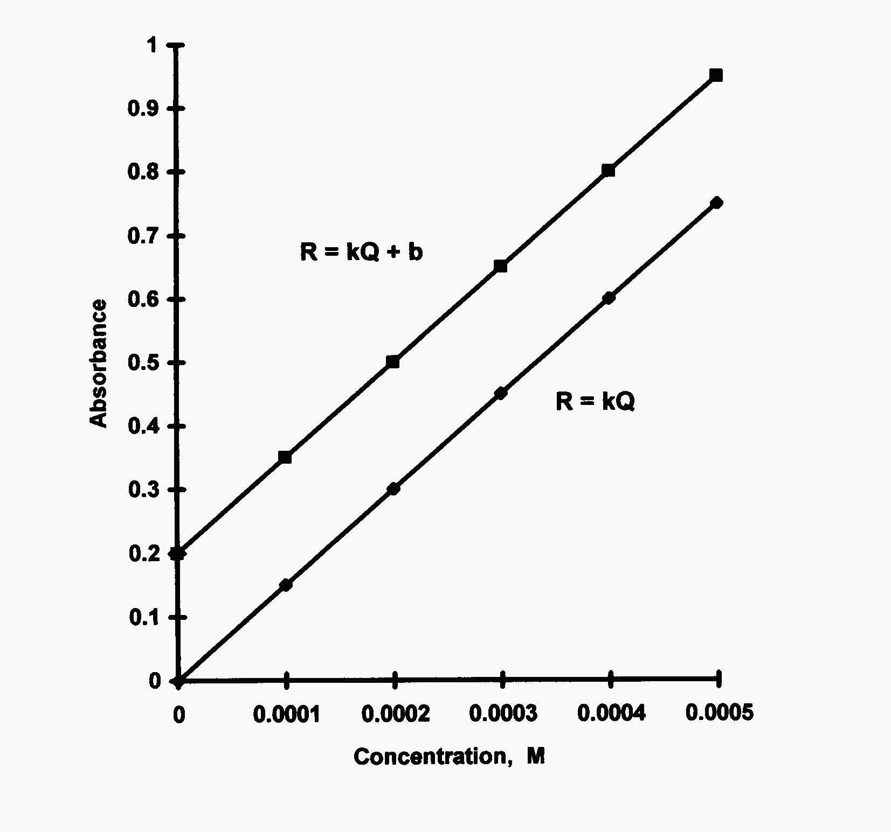
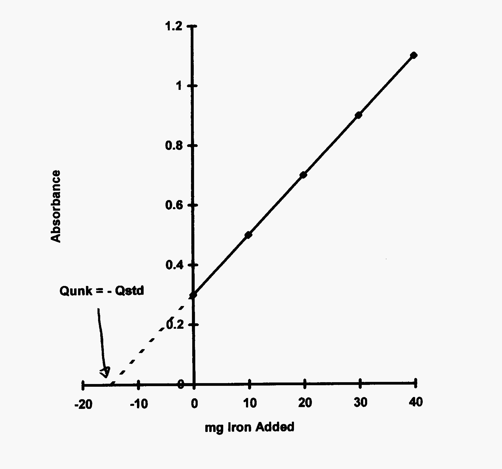

Instrument Calibration
======================

An instrument must be calibrated every day or the values coming out of its
readout device are not worth writing down.  There are several methods for
calibration.  None of these methods is “best” for all instrumental methods and a
technique perfect for one method might be atrocious for another.  Picking the
proper method for calibration can make or break your analysis. Every instruments
response (:math:`R`) can be equated to the quantity of analyte being measured (:math:`Q`) times
the  instrumental and physical constants, unit conversions, etc. (:math:`k`) that go
into each particular technique.  The resulting response equation:

.. math:: R  =  k  Q

is the foundation for each of the calibration techniques.

Calibration or Working Curve
----------------------------
This is the most common of all the calibration techniques.  It is useful for
running multiple samples as long as all sample have a similar and simple matrix.
In a calibration curve approach, the samples and standards must have similar
chemical matrices.  A changing matrix can yield a changing response as
interferents become involved (thus :math:`k` is no longer constant).

To obtain a calibration curve, a series of standards are prepared that bracket
the sample concentrations, usually with at least two standards above and two
standards below those values for the samples. The instrumental response is then
obtained for a blank, for each standard, and for the sample. The resulting data
are plotted as concentration of standards or ideally “quantity” of analyte in
each standard vs. instrumental response. The standards are generally chosen so
as to fall into the linear dynamic range of the instrument being used. This
simplifies the data reduction to using the equation for a straight line and
algebraically solving for the quantity in the unknown.  All samples are diluted
so as to fall near the center of the calibration curve.  Plots (see
:numref:`workingcurve`) can be driven through the :math:`y`-intercept as in most
spectroscopic techniques or can have the measured blank response and a non-zero
intercept.

.. _workingcurve:

   Calibration or working curves for both zero and nonzero intercepts.

A single point analogue is not recommended unless a ballpark result is
acceptable.  To run a single point ‘curve’, the response of a sample and a
standard are measured and a ratio is set up to calculate the ‘concentration of
the sample’.  You can get lucky and get very accurate results.  You can also
loose big time and with a single point — will be blissfully ignorant!

.. important::
   Always measure and plot a Blank!

Standard Additions
------------------
A standard additions approach is used when the matrix of the samples are unknown
or too difficult to be matched.  In these cases, the simpler calibration curve
approach is not useful.  As one can gather from the name, standard is added
directly to the sample and response is measured.  Again this can be done as a
single point or plotting analogue.

The standard additions method can take several forms\ [#f1]_ depending on the
instrumentation being used.  To obtain a standard additions plot for a
spectrophotometric analysis, several solutions are made containing an identical
amount of sample and varying amounts of standard including zero added.  Each of
these solutions is then diluted to an equal volume and the absorbance is then
read for each solution. The plot will be of quantity of standard added as the
independent variable vs. instrumental response as the dependent variable.
Please note that while the quantity can be concentration, solution volume,
calculated mass, or any other representation of the physical amount of standard
added, it will usually be identical to normal calibration plots so comparison of
slope can be made to determine presence of a matrix effect!  Alternatively, a
plot can be made by measuring the response for the sample alone followed by
measuring the response after small amounts of standard have been added to
solution of sample.  This method is useful for potentiometric or voltammetric
methods or where the amount of sample available is limited.  Correction must be
made for the added volumes of the standard.

.. _stdadd:

   
   Standard additions plot showing :math:`Q_{\text{unk}} = -Q_{\text{std}}` for
   response of zero and no standard added.
  
The mathematics on this have proven interesting to some students.  The response
equation for the plot is

.. math:: R = k (Q_{\text{u}} + \Delta Q)

or rearranging:

.. math:: R =  k \Delta Q + kQ_{\text{u}}

so a plot of :math:`R` vs. :math:`\Delta Q` as shown in :numref:`stdadd` will
have a slope of :math:`k` and an intercept of :math:`kQ_{\text{u}}`. Incidently,
if the matrix has no effect, the slope, :math:`k`, of the calibration curve and of the
standard additions plot will be identical.  Let’s solve the latter equation when
the response equals zero:

.. math::
   R = 0 &= k \Delta Q + kQ_{\text{u}} \\
   -k \Delta A &= k Q_{\text{u}} \\
   -\Delta Q &= Q_{\text{u}}     

So, the negative of the added quantity of standard will be equal to the unknown
quantity of analyte in the sample. Make sure to correct all readings for the
blank before plotting and use only linear plots.

.. important::
   Standard addition plots **must** be linear and be blank corrected!

Internal Standards
------------------
When the instrumental constants may also vary, the internal standard approach is
used in conjunction with another calibration method.  In this technique, a very
similar substance having a similar response but in a different location
(wavelength, potential, etc.) is used at a constant quantity in each sample of
standard and sample.  The response of the analyte is then compared to the
response of the internal standard to balance out changing instrumental
parameters.  This is not a calibration method of its own.

The internal standard must be a material that

* does not interfere with the sample
* must be added in identical amounts to all samples and standards
* must respond to instrument in a like fashion as the sample (constant slopes)
 
The resulting response equations are based on both the sample and the internal
standard:

.. math:: R  =  kQ \qquad R_{\text{IS}} =  k_{\text{IS}}Q_{\text{IS}}
  
Let’s define a new constant :math:`Z`, where :math:`Z` is the ratio of the
individual :math:`k`’s, :math:`Z = \frac{k}{k_{\text{IS}}}` and :math:`Z` must be a
constant. So that any parameter affecting :math:`k` will identically affect
:math:`k_{\text{IS}}`.  Substitution of :math:`Z` into the above yeilds:

.. math:: R  =  kQ = Z k_{\text{IS}} Q = Z \left( \frac{R_{\text{IS}}}{Q_{\text{IS}}} \right) Q

or rearranging:

.. math:: \frac{R}{R_{\text{IS}}}  =  \left( \frac{Z}{Q_{\text{IS}}} \right)  Q

A plot of :math:`\frac{R}{R_{\text{IS}}}` vs :math:`Q` will look like a standard
calibration curve with the instrumental variability removed.  Again, the blank
must be corrected for.

Absolute Techniques
-------------------
In an absolute technique, the constants involved in the calibration curve are
assumed to be known and used in the sample determination.  For example, in a
Beer’s law analysis, a species is known to have a molar absorptivity of 10,000
L∙atm/mol∙K.  If a solution of the species in a 1.00 cm cuvette has an absorbance
of 0.345, then the concentration must obviously be 3.45 × 10\ :sup:`-5` M.  Obviously as
long as nothing instrumentally is changing the value of ε!  A scratch on the
cuvette would be largely negated by one of the above methods but not in an
absolute one.  Similarly, if a ISE meter is calibrated so that pH 7.00 has a
value of 0.0 mV, then a solution of -118.32 mV must be pH 5 since pH changes by
59.16 mV per decade!  Again, as long as the electrode knows it is supposed to
change by 59.16 mV per decade. Perhaps a heart-to-heart talk?  As you can guess,
this is not a good choice unless you have lots of prior experience with the
analyte and technique, usually with the past support of a lot of data indicating
the constant has been invariant.

.. [#f1] The reader is referred to `M. Bader, *J. Chem. Ed.*, 1980, **57**, 703.
   <https://research-ebsco-com.proxy-commonwealthu.klnpa.org/linkprocessor/plink?id=7dfdee28-1563-3edd-9f0b-1ee98d25337d>`_
