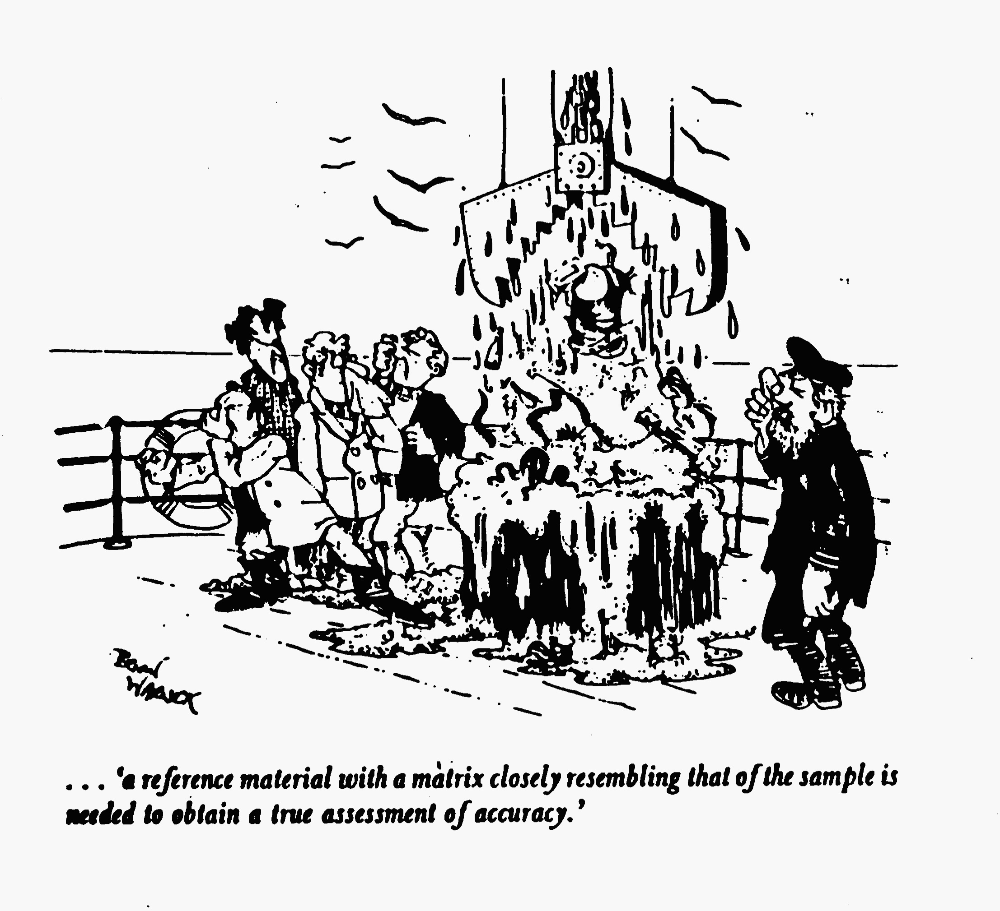

Solutions Preparation
=====================

Introduction
------------
This is not actually an experiment.  Rather it is a set of information to be
used in preparing standard solutions of known concentrations for use in
calibrating chemical instruments. Virtually all analytical instruments require
frequent (usually daily) calibration to insure precision and accuracy in
analysis.  Typically calibration is accomplished by making a set of standard
solutions (solutions of known analyte concentration) and measuring the
instrumental response to those solutions.  It is imperative that the standard
solutions be made accurately and that requires careful solutions preparation
technique. The process of making standard solutions involves two steps:
calculations and actual solution preparation.  The complexity of each of the
steps depends on the analyte and the required concentrations.

Calculations
------------
Before making standard solutions the analyst must carry out some calculations to
establish what steps will be done to produce the desired solutions.  Usually a
concentrated stock solution is made and then diluted by different amounts to
produce the various standard concentrations.

Concentration Units and Conversions
~~~~~~~~~~~~~~~~~~~~~~~~~~~~~~~~~~~
We will use two solution concentration units, molarity (M) and ppm, and one
concentration unit for solids (wt/wt %).  The units will be defined and a quick
method for converting from molarity to ppm and vice versa will be presented.

Molarity
++++++++
Molarity is defined as moles of solute per liter of solution and is given the
symbol M.  This unit is typically used for medium to high concentration
solutions.  Molarity describes what is actually in the solution.  A solution
made by dissolving one mole of NaCl (a strong electrolyte which is completely
dissociated) in 1 L of solution can properly be said to be 1 M in Na\ :sup:`+` or 1 M in
Cl\ :sup:`-`. The Formality, F, of the solution tells what went into the solution and has
the same units as molarity.  The above solution has a formality of 1 F in NaCl.
Formality and molarity are usually used interchangeably, and we will be guilty
of that simplification in this course, i. e. the above solution could be said
(technically incorrectly) to be 1 M in NaCl. You may frequently see
concentrations expressed in millimolarity, mM. A 1 mM solution is 0.001 M.

Parts-per-million
+++++++++++++++++
Parts-per-million, ppm, is defined as micrograms of solute per gram of solution.
This unit is used for solutions that are relatively dilute.  In dilute aqueous
solutions the approximation is made that 1 gram of solution occupies 1 mL, thus
changing ppm to 1 microgram per mL (or 1 mg/L) of solution.  This approximation
is good as long as the solution is near room temperature and the solution is
dilute enough that the solute does not change the density from that of pure
water. Note that a 1 ppm-solution of NaCl is *not* 1 ppm in Na\ :sup:`+` (it is about 0.4
ppm Na\ :sup:`+`).

Conversion from M to ppm
++++++++++++++++++++++++
Converting from one of the above units to another can be handled by remembering
one concept. The concentration of a 0.001 M (1 mM) solution in ppm is equal to
the number of grams of solute per mole of solute.  An example is a 0.001 M
solution of NaCl is 58.4 ppm NaCl (NaCl is 58.4 g/mole).  A 0.001 M solution of
Na\ :sup:`+` is 23.0 ppm Na\ :sup:`+`.

wt/wt %
+++++++
Wt/wt % is defined as grams of solute per 100 g of sample, and can be calculated
as (g solute/g sample) × 100 %.  This unit is usually used to describe solid
solutions or mixtures.  The concentration of analyte must be relatively high for
this unit to be useful.

Dilution Calculations
~~~~~~~~~~~~~~~~~~~~~
It is necessary to perform calculations to establish how standard solutions will
be made.  Three types of calculations will be presented: making a stock solution
from a solid, doing a one-step dilution, and doing a two-step dilution. There
are several limitations that must be kept in mind when establishing solutions
preparation steps:

1. When weighing out solid you should weigh out at least 1 gram and not more
   than 10 grams.  This ensures less relative error, good precision and keeps
   costs reasonable.

2. Volumetric flasks come in sizes from 10 mL to 2 L.
   These should be used for all cases where a specific volume of solution is to
   be made.
  
3. Volumetric pipets come in sizes from 1 to 100 mL.  Volumetric
   pipets or burets should be used for all dilutions. Micropipets, available in
   sizes from 10 μL to 5 mL may also be used. Keep in mind that less relative
   error is encountered as the measurement size goes up.

Another decision that must be made at this point is what the primary standard
solid will be. There are several sources for finding what solid to use:

1. If you have an elemental analyte and can obtain a pure sample of the analyte
   that is the best starting material. This is possible for many metals, e. g.
   copper and iron.
  
2. Standard methods of analysis books are published by
   several groups (Environmental Protection Agency, Association of Official
   Analytical Chemists, American Society for Testing Materials).  These
   references will provide information on primary standards and other matters
   regarding analysis.
  
3. Instruments often have methods books supplied, which describe methods and
   materials for standards preparation.  These are best since they are specific
   for that application.

Making a stock standard solution
++++++++++++++++++++++++++++++++
A stock solution is one that has a known concentration of analyte but is more
concentrated than the standards that will be used for calibration.  This process
requires three steps:

1. Calculate the number of moles of analyte needed to make the required volume
   of the desired concentration.

2. Calculate the mass of solid needed to give the correct number of moles of
   analyte using the formula weight of the solid.
  
3. Weigh out the solid, dissolve it in a small amount of solvent, quantitatively
   transfer the solution to a volumetric flask and dilute to the mark.

..
   SAMPLE CALCULATION:
  
One-step Dilution
+++++++++++++++++
The following steps should be used to do a one-step dilution of a stock solution
to produce a more dilute standard solution:

1. Calculate the amount (moles or grams) of solute needed in the required volume
   of the desired concentration.
  
2. Calculate the volume of stock solution
   needed to give that amount of solute.
  
3. Volumetrically transfer the
   necessary volume of stock solution to a volumetric flask and dilute to the
   mark.
  
4. If the required volume of stock solution is less than 1 mL you will
   need to do a two-step dilution.

.. 
   SAMPLE CALCULATION:
   
Two-step Dilution
+++++++++++++++++
The following steps should be done to perform a two-step dilution:

1. Perform step 1 from the one-step dilution.

2. Do a volumetric 1 to 10 or 1 to 100 dilution of the stock solution.

3. Calculate the volume of the diluted stock solution required to give the
   necessary amount of solute.

4. Volumetrically transfer the required volume of diluted stock solution to a
   volumetric flask and dilute to the mark.

..
   SAMPLE CALCULATION:

Making Standard Solutions
-------------------------

A. Handling Primary Standards (see pertinent pages in Harris)

   1. Drying and weighing procedures

      Some primary standards need to be dried before weighing and some don't.
      Be sure to consult the reference that identified the primary standard to
      find out drying temperature and time.  The chemical formula of the
      primary standard may be changed (particularly the number of waters of
      hydration) by drying so be sure you know what you're doing before you dry
      the standard.

      When weighing the primary standard, **weigh by difference**
      using an analytical balance into the vessel in which you intend to
      dissolve the solid.

   2. Dissolution of the Primary Standard

      Usually the source reference will provide information about how to dissolve the
      solid standard. If no dissolution information is provided check the solubility
      of the compound in the CRC Handbook or Merck Index before proceeding.  Start
      with mild conditions and use more drastic measures (acid and/or heat) if
      necessary.  The standard solvent should match the matrix of the unknown as
      closely as possible.

