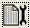

OceanInsight USB Spectrometers
++++++++++++++++++++++++++++++

Techniques
==========

Basic Absorbance
----------------

1. Ensure that the spectrometer is plugged into a power outlet.

   .. important::

      This step **must always** be performed first to avoid damaging the instrument.

2. Plug the USB cable from the spectrometer into the computer.

   .. note::

      If you have the newer-model FLAME UV-Vis, make sure to turn on the
      small power switch on the front of the spectrometer.

3. Open OceanView from the desktop (|oceanview-icon.png|).

4. A Welcome Screen should appear. Click on “Spectroscopy Application
   Wizards”.

   .. figure:: images/welcome-annotated.png

5. Select “Absorbance (Concentration)”.

   .. figure:: images/application-wizard-annotated.png

6. Select “Absorbance only” and then Next.

7. Insert a blank cuvette containing either water or the solvent you
   will be using. Make sure the cuvette was cleaned of all fingerprints!

   .. important::

      If your cuvette has frosted sides, be sure that the transparent sides
      are in line with the source and detector.

8.  Set your acquisition parameters.

    .. figure:: images/aquisition-controls.png

    1. Check the Strobe/Lamp Enable checkbox. This turns on the lamp.
       You should now be able to view the detector input on the right.

    2. Most likely, your input will be saturated. Lower the integration
       time until the entire spectrum fits on the screen. The software
       will give you a message when your spectrometer is in range.

    3. If you notice that your spectrum is “bouncing”, increase the
       scans to average. I recommend a value of ``4``.

    4. Click Next.

9.  Click the large yellow light bulb to store your reference spectrum.
    This is your 100 % transmittance spectrum. Click Next.

10. Turn off the lamp by unchecking the Strobe/Lamp Enable checkbox.
    Then, click the gray light bulb to store your dark spectrum. This is
    the 0 % transmittance spectrum.

    .. tip::

       Remember to turn the lamp back on before clicking Finish!

11. The software should send you to a view window. Note that this is the
    raw detector input. To monitor absorbance, switch to the absorbance
    view by clicking on the tab near the top of the screen.

    .. figure:: images/absorbance-view.png

12. Configure your save data location by clicking the
    |configure-save.png| icon.

    .. figure:: images/file-saver.png

    -  Make sure that the file format is “ASCII (with header data)”.

    -  Note the “Target Directory”. This is where your data will be
       saved. You may change this if desired to your own custom folder.
       Just make sure to remember where your data is being saved!

    -  You can change the format of the filename under Filename
       Decoration.

    -  When you are finished, make sure to click Apply and then Exit.

    .. warning::
    
       Flash memory has a tendancy to fail. Save to the computer first and
       then copy to a USB flash drive.

13. When you have a spectrum you would like to save, press the
    |save.png| icon. This icon will turn red and a
    message "File saving in progress" will appear at the bottom of
    the screen. Make sure that this disappears before removing the
    cuvette with the sample in it!

14. Continue recording spectra as necessary. You may click on the graph
    to obtain the absorbance value at a specific wavelength.

15. When finished, close the software, copy your data to a USB flash
    drive, and log out of the computer.

DH-mini Dip Probe
-----------------

.. note::
   Since new software was installed to replace the old SpectraSuite, the
   following instructions are outdated. The general setup should still
   be the same.

Startup
~~~~~~~

1. Turn on the power switch on the back of the DH-mini.

2. Push “TTL/Manual” — The LED should turn off indicating that the light
   source is in manual mode.

3. Push “On/Off Deuterium” — The LED should turn on indicating that the
   UV light source is on.

4. Open SpectraSuite from the desktop.

   .. figure:: images/spectrasuite.png

   .. tip::

      Minimize “Data Views” section if it is too large.

5.  Set the Boxcar averaging to ``4`` to reduce noise.

6.  Immerse the dip probe in your solution. Ensure there are no air
    bubbles in the sensing window.

    -  Swirl your flask vigorously to remove any bubbles.

    -  Position the dip probe so that it does not get hit by the stir
       bar. You may need to angle the probe.

7.  Collect a “Dark” spectrum by clicking the dark lightbulb
    (|dark.png|) — this serves as your 0 %T spectrum.

8.  On the DH-mini, push “Open/Close Shutter” — The LED should turn on
    indicating that the shutter is open.

9.  Adjust the integration time so that the spectrum is at its maximum
    intensity without being cut off.

    .. figure:: images/inttime.png

10. Close the shutter and retake a dark spectrum.

11. Open the shutter. Once the spectrum is stable, collect a “Light”
    spectrum by clicking the light lightbulb (|light.png|) — this serves
    as your 100 %T spectrum.

12. Select absorbance mode (|absorbance.png|).

13. Select Strip Chart (|stripchart.png|)

    -  Select “Update every scan”

    -  Select “Pause until started by user”

    -  Select “Stop after” and enter ``4 minutes``.

    -  Change the range to monitor one wavelength: ``420 nm``

Analysis
~~~~~~~~

1. When ready to collect data, press the start button.

2. When complete, be sure to save your data.

   1. Click the save icon (|save.png|)

   2. Browse to a folder *on the computer*

   .. warning::

      Save to the computer first and *then* to a flash drive. Flash drives
      are prone to errors, so we want to make sure you have a backup!

3. Give the file a recognizable name.

4. Click save, select the “Trend” you wish to save, then press save
   again.

5. You should get a message saying that the file was saved. If so, close
   the window.

6. Remove the dip probe and rinse thoroughly with deionized water before
   switching to your new sample.

   When you immerse the probe in your new sample, you should switch back
   to “Graph A” and check to make sure your baseline is at ``0``. You
   may need to retake your dark and light spectra.

7. Press the “Clear” button and then “Restart trend” to run another
   measurement.

Shutdown
~~~~~~~~

1. Ensure all data has been saved to a location *that you can find on
   the computer*.

2. Copy the data from the computer to a USB drive (or email to yourself,
   upload somewhere, …)

3. Push “On/Off Deuterium” to turn off the deuterium lamp.

   .. important::

      Do not turn off the main power switch. The box must be left powered
      on to cool.

4. Close the SpectraSuite software.

5. Log out of the computer.

.. |oceanview-icon.png| image:: images/oceanview-icon.png
   :width: 20px

.. |save.png| image:: images/save.png
   :width: 20px

.. |absorbance.png| image:: images/absorbance.png

