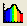
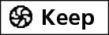

Vernier USB Spectrometer
========================

Getting Started
---------------

1. If not already plugged in and turned on, connect the AC power supply
   to the spectrophotometer. Turn the power switch to the ON position.

2. When the LED for the lamp indicator stays green, connect the
   spectrophotometer to a powered USB port on the computer or a powered
   USB hub.

3. Start :program:`Logger Pro 3` software on your computer.

Calibration of Spectrometer
---------------------------

1. To calibrate the spectrophotometer, choose :menuselection:`Calibrate --> Spectrometer`
   from the Experiment menu. For best results, allow the
   spectrophotometer to warm up for a minimum of ten minutes.

2. Fill a cuvette about ⅔ full with distilled water to serve as the
   blank. After the spectrophotometer has warmed up, wipe the sides of
   the cuvette with a Kimwipe and place the blank cuvette in the
   spectrophotometer. Align the cuvette so the clear side of the cuvette
   is facing the light source. Make sure the water does not spill out
   into the unit and that the line on the cuvette matches the notch on
   the instrument.

3. Follow the instructions in the dialog box to complete the
   calibration, and then click |vernier-ok.png|.

Measurement
-----------

1. Click the Configure Configure Spectrometer Data Collection button,
   |vernier-data-collection.png|. There are three regions in this box;
   we want the first:

   Collection Mode
      The three options for data collection are offered. If the measurement
      (Absorbance in this example) vs. Time or vs. Concentration is selected, a
      wavelength or wavelengths will need to be chosen.

2. Select Absorbance vs. Concentration as the data-collection mode. The
   wavelength where our compound absorbs the most light (λmax = 562 nm)
   will need to be selected in the list to the right. Make sure all
   other wavelengths are unselected.

3. Click |vernier-ok.png| to continue.

4. Click |vernier-collect.png|. Place your first sample in the cuvette
   slot of the spectrophotometer. After the readings stabilize, click
   |vernier-keep.png|. Enter the concentration of the sample and click
   |vernier-ok.png|.

5. Place your second sample in the cuvette slot. After the readings
   stabilize, click |vernier-keep.png|. Enter the concentration of the
   second sample and click |vernier-ok.png|.

6. Repeat the previous step for the remaining samples. When finished,
   click |vernier-stop.png| to end data collection.

7. The data may be copied from the spreadsheet and pasted directly into
   Excel for analysis. For unknown measurements, place the cuvette
   containing an unknown in the spectrometer and write the absorbance
   value down in your notebook. Use the trendline to determine unknown
   concentrations.

.. |vernier-ok.png| image:: images/vernier-ok.png
   :width: 50px

.. |vernier-collect.png| image:: images/vernier-collect.png
   :width: 50px

.. |vernier-stop.png| image:: images/vernier-stop.png
   :width: 50px
